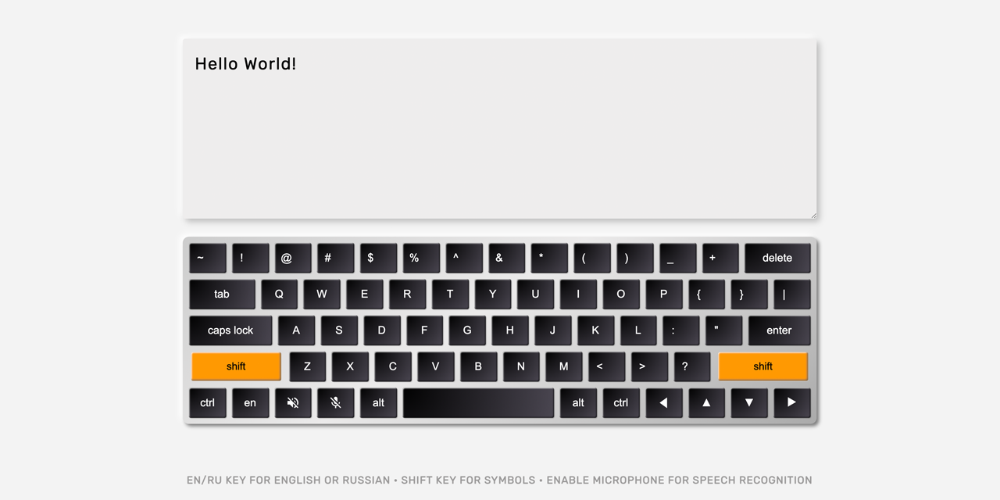

<table><tr>
<td>  </td>
<td>  </td>
<td>  </td>
</tr></table>

 

 

 

 

#

  

- [100 Days of Code](#100days)
- [Installation](#installation) 
- [Demo](#demo)
- [Resources](#resources)
- [Let's Connect!](#lets-connect) 

#

  

#

#

  

#

  

#

<a href="https://twitter.com/Emmanuel_Labor"> <a href="https://www.linkedin.com/in/emmanuelpjose/"> <a href="https://emmanueljose.medium.com/"> <a href="https://www.instagram.com/emmanuel_jose/"> <a href="mailto:emjose@gmail.com"> <a href="https://www.youtube.com/channel/UCQdqFg-_J83jn9xJRd1W3tQ/videos"> <a href="https://github.com/emjose">

#

 

